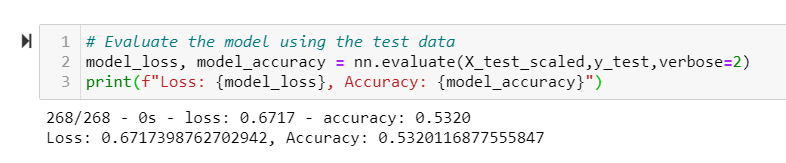

# Neural_Network_Charity_Analysis
Beks is a data scientist and programmer with a nonprofit organization Alphabet Soup.  Beks is in charge of data collection and analysis for the entire organization.  She analyzes the impact of each donation and vets potential recipients to help ensure the monies are used effectively.  President Andy Glad has asked Beks to predict which organizations they should donate to and which are too high-risk.   

## Resources
Software(s): Python 3.7, TensorFlow 2.6.0, Scikit-Learn 0.24.1, Plotly, hvPlot 0.7.3, Pandas 1.2.4, Jupyter Notebook

## Purpose
You’ll use the features in the provided dataset to help Beks create a binary classifier that is capable of predicting whether applicants will be successful if funded by Alphabet Soup.

## Results

Using bulleted lists and images to support your answers, address the following questions.

### Data Preprocessing 
* What variable(s) are considered the target(s) for your model?  Response:  IS_SUCCESSFUL Column 
* What variable(s) are considered to be the features for your model?  Response:  All others except the target and two dropped columns 
* What variable(s) are neither targets nor features, and should be removed from the input data?  Response:  EIN and NAME columns 

### Compiling, Training, and Evaluating the Model 
* How many neurons, layers, and activation functions did you select for your neural network model, and why?  Response:  There were two hidden layers:  Layer 1 included 80 neurons and Layer 2 included 30, both used the relu activation function.  The output layer used the sigmoid function. 
 

* Were you able to achieve the target model performance?  Response:  No, the accuracy was only 47%. 
 

* What steps did you take to try and increase model performance? 
Response:  Attempt 1 - Layer 1 increased neurons to 120 and Layer 2 to 45, both used the relu activation function, resulting in an accuracy of 69%. 

 
 

Attempt 2 - An additional layer of 20 neurons was added, all three layers used the relu activation function, resulting in an accuracy of 53%. 

 
 

Attempt 3 - Layer 1 and Layer 2 used the tanh activation function, and Layer 3 used the relu activation function, resulting in an accuracy of 55%. 

 
 

## Summary

Summarize the overall results of the deep learning model. Include a recommendation for how a different model could solve this classification problem, and explain your recommendation.  Response:  None of these attempts were able to increase accuracy to 75% or higher.  We could possibly remove more features or add more data to increase accuracy.  Otherwise, we could use Random Forest Classifier: a random forest algorithm will sample the data and build several smaller, simpler decision trees that try to select the best feature at every split.  How often a feature gets selected over the whole random forest model gives us an indication of how important that feature is. Each tree is considered a “weak classifier,” but when you combine them, they form a “strong classifier.” 
